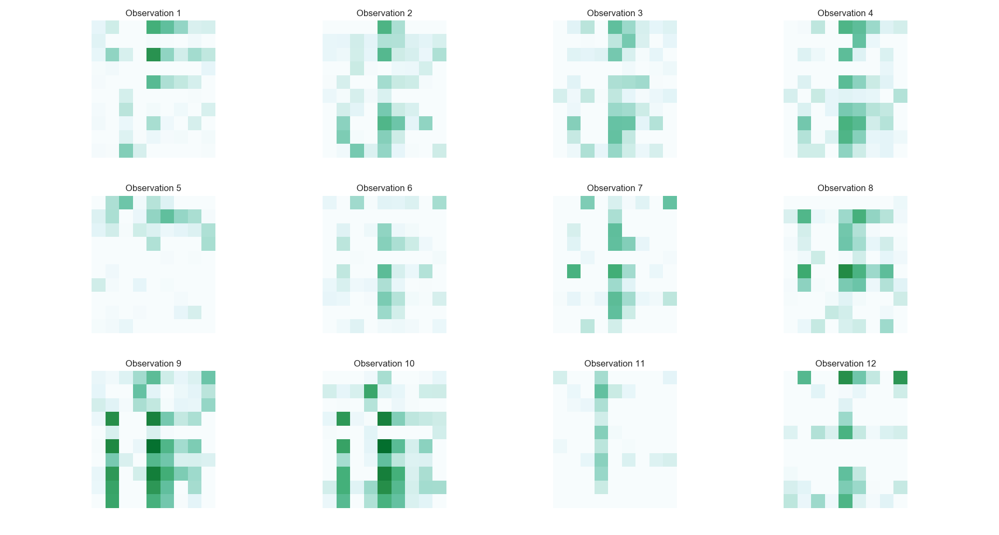
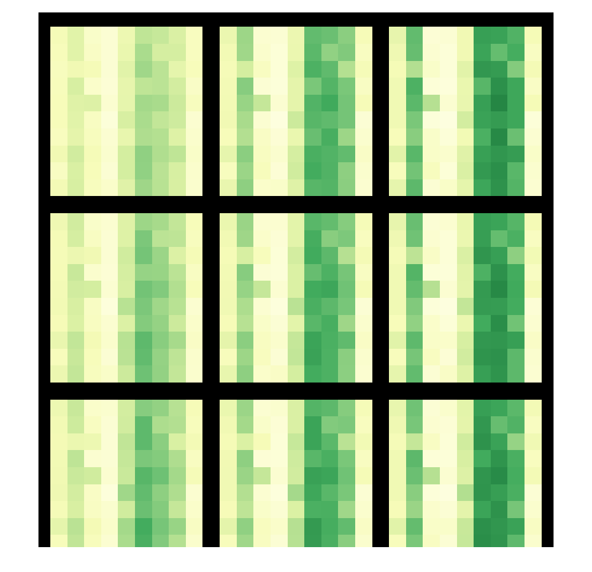

\newcommand{\btheta}{\boldsymbol{\theta}}
\newcommand{\bSigma}{\boldsymbol{\Sigma}}
\newcommand{\bnu}{\boldsymbol{\nu}}
\newcommand{\bepsilon}{\boldsymbol{\epsilon}}
\newcommand{\bx}{\mathbf{x}}
\newcommand{\by}{\mathbf{y}}
\newcommand{\bz}{\mathbf{z}}
\newcommand{\bB}{\mathbf{B}}
\newcommand{\bD}{\mathbf{D}}
\newcommand{\bW}{\mathbf{W}}
\DeclareMathOperator{\Diag}{Diag}
\newcommand{\sN}{\mathcal{N}}
```{r setup, include=FALSE}
knitr::opts_chunk$set(echo = FALSE)
```
# An Overview of Probabilistic Generative Latent Models

***

## What is a Latent Variable?


## What is a Latent Variable Model?

$$
\by \in \mathbb{R}^{N \times P }; \by_n \in \mathbb{R}^{P}; \bz_n \in \mathbb{R}^{D}; \btheta \in \mathbb{R}^{M}\\
p(\by_1,\cdots,\by_N,\bz_1,\cdots,\bz_N,\btheta) = p(\btheta)\prod_{n=1}^N\ p(\by_n\mid\bz_n,\btheta)p(\bz_n\mid\btheta)$$
<hr>
<div style="width:600px; height:250px; margin:auto">

</div>

***

## Class of Latent Variable Models

>- Matrix factorization models (e.g. PCA, Factor Analysis)
>- Multilevel regression models (e.g. random effects model)
>- Time series models (e.g. Hidden Markov Model)
>- Dirichlet process mixture models
>- Deep latent variable models (e.g. VAE)
>- And others ...

***

## Multivariate Models

$$p(\by_1,\cdots, \by_N, \bx_1,\cdots, \bx_N, \theta)$$

$$\prod_{n=1}^Np(\by_n \mid f_{\theta}(\bx_n),\theta^{Y})p(\theta^{Y})\prod_{n=1}^N p( \bx_n \mid \theta^{X})  p(\theta^X)$$

## Multivariate Regression

$$\prod_{n=1}^N  \sN_p( \by_{n} \mid \bB \bx_n, \ \bSigma)$$

***

## Reduced Rank Regression

$$\textit{Let } \overset{p\times m}{\mathbf{B}}=\overset{p\times d}{\mathbf{W}}\ \overset{d\times m}{\mathbf{D}}\\
\prod_{n=1}^N  \sN_p( \by_n \mid \bW\bD\by_n, \ \bSigma)$$

<br>
<br>
<hr>
<small> @izenman2008 </small>


## Latent Variable Models

$$\textit{Let } {\bz_n}=\overset{d\times m}{\mathbf{D}}\overset{m\times 1}{\by_n}\\
\prod_{n=1}^N  \sN_p( \by_n \mid \bW\bz_n, \ \bSigma)$$

## Examples of Common Latent Variable Models


***

## Principle Component Analysis (PCA)

$$
\prod_{n=1}^N  \sN_p( \by_n \mid \bW\bz_n, \ \sigma^2\mathbf{I}) \mathcal{N}_d(\bz_n \mid \boldsymbol{0},\,\mathbf{I})
$$

### As a generative model 

$$
\bz_n\ \sim\ \mathcal{N}_d(\boldsymbol{0},\,\mathbf{I}) \quad  n=1,\cdots,N \\
\by_n \mid  \bz_n \sim\ \mathcal{N}_p(\bW\bz_n,\, \sigma^2\mathbf{I})
$$

<br>
<br>
<hr>
<small> @tipping1999 </small>


## Factor Analysis (FA)

$$
\prod_{n=1}^N  \sN_p( \by_n \mid \bW\bz_n, \ \Diag(\sigma^2)) \mathcal{N}_d(\bz_n \mid \boldsymbol{0},\,\mathbf{I})
$$

### As a generative model 

$$
\bz_n\ \sim\ \mathcal{N}_d(\boldsymbol{0},\,\mathbf{I}) \quad n=1,\cdots,N \\
\by_n \mid  \bz_n \sim\ \mathcal{N}_p(\bW\bz_n,\,\Diag(\sigma^2) )
$$

***


## Variational Autoencoder (VAE)

<br>
<br>

$$\mathbf{z}_n\ \sim\ \mathcal{N}_d(\boldsymbol{0},\, \mathbf{I}))  \quad n=1, \cdots,N\\
\by_n \mid  \bz_n \sim\ \mathcal{N}_p(\mathbf{NN}_{\mu}(\bz_n;\btheta),\, \mathbf{NN}_{\sigma}(\mathbf{z}_n;\btheta)))
$$

<br>
<br>
<hr>
<small> @Kingma2013 </small>

## Deep Latent Gaussian Models (DLGM)

$$\mathbf{z}_n^{(L)}\ \sim\ \mathcal{N}_{d_{(L)}}(\boldsymbol{0},\, \mathbf{I}))  \quad n=1, \cdots,N \\
    \bz_n^{(l)}\ \sim\ \mathcal{N}_{d_{(l)}}(\bz_n^{(l)} \mid \mathbf{NN}^{(l)}(\bz_n^{(l+1)};\btheta^{(l)}),\, \Sigma^{(l)} )\quad l=1, \cdots,L-1\\
\by_n \mid  \bz_n \sim\ \mathbf{Expon}_p(\by_n \mid \mathbf{NN}^{(0)}(\bz_n^{(1)};\btheta^{(0)}))\\
$$
<hr>
$$ 
\textit{where } \quad
\mathbf{NN}(\bz;\theta) = h_K \circ h_{K-1} \circ \ldots \circ h_0(\mathbf{z}) \\
 \quad h_k(\by) = \sigma_k(\mathbf{W}^{(k)} \by+\mathbf{b}^{(k)})\\  
 \btheta = \{ (\mathbf{W}^{(k)}, \mathbf{b}^{(k)}) \}_{k=0}^K
$$
<hr>
<small> @rezende2014 </small>


# Application of a Deep Latent Variable Model to the Unsupervised Learning of Chromatin States

## Background

***

### The General Problem 

*Molecular phenotype* = $\Phi$( *genome, environment*)


<div style="width:1000px; height:400px; margin:auto">
</div>

***

### The Specific Computational Problem

*TF binding* = $\Phi_1$(*regulatory DNA*)

*Gene Expression* = $\Phi_2$(*TF binding*)

<div style="width:400px; height:200px; margin:auto">

</div>

***

###  Chromatin Architecture 

<div style="width:900px; height:500px; margin:auto">

</div>

***

##  Data 

- A total of 100  ENCODE epigenomic datasets were used 
     - 10 ENCODE cell types
     - 10 ChIP-seq datasets (genome-wide signal coverage) 

***

###  Cell Types 


<div style="width:700px; height:500px; margin:auto">

</div>

***
<div style="width:700px; height:500px; margin:auto">

</div>

***
###  Epigenomic Marks

<div style="width:800px; height:500px; margin:auto">

</div>


***

<div style="width:450px; height:340px; margin:auto">

</div>

***

##  Preprocessing 

(1) Creating a blacklist file of excludable genomic regions
(2) Segment the human reference genome into 200bp bins
(3) Discard regions that overlap the blacklist
(4) Combine 100 bigWig signals into one data-frame
(5) Average the signal over the 200bp segments
(6) Subtract control signal from other 9 signals for each cell-type
(7) Normalize the signals
(8) Create labels from available functional annotation data

***

### Visualizing the Observations

<div style="width:1000px; height:800px; margin:auto">

</div>


***

## Model: The Variational Autoencoder


<div style="width:500px; height:360px; margin:auto">

</div>


***

## Generative Network

$$
p(\by,\bz) =\prod_{n=1}^N  \mathbf{Bernoulli}_p(\by_n \mid \mathbf{NN}(\bz_n;\btheta))\mathcal{N}_d(\bz_n \mid \boldsymbol{0},\,\mathbf{I})
$$
$$ 
\textit{where } \quad
\mathbf{NN}(\bz;\theta) = h_K \circ h_{K-1} \circ \ldots \circ h_0(\mathbf{z}) \\
 \quad h_k(\by) = \sigma_k(\mathbf{W}^{(k)} \by+\mathbf{b}^{(k)})\\  
 \btheta = \{ (\mathbf{W}^{(k)}, \mathbf{b}^{(k)}) \}_{k=0}^K\\
 \textit{is a function parameterized by a deep neural network}
$$

***

## Implicit Models

<div style="width:900px; height:500px; margin:auto">


***

## Variational Approximation Network

Since the true posterior is intractable 
$$p_\theta(\mathbf{z}_n \mid \mathbf{y}_n) = \frac{p(\by_n \mid \bz_n)p(\bz_n)}{p(\by_n)}\\$$

We introduce an approximate posterior distribution


$$q(\mathbf{z}_n \mid \mathbf{y}_n;\bnu) = \mathcal{N}_d\big(\bz_n \mid \mathbf{NN}_{\mu}(\by_n;\bnu),\, \mathbf{NN}_{\sigma}(\by_n;\bnu)\big) \\$$

***

And minimize Kullback–Leibler divergence between the approximate posterior and the true posterior

<div style="width:800px; height:500px; margin:auto">

</div>

***

## Variational Inference for VAE

</br>

 > “Far better an approximate answer to the right question, which is often vague, than an exact answer to the wrong question, which can always be made precise.” - **John Tukey**
    

***

## Network Architecture

>- **Generative Model Network**
>     - Nonlinearities: *Input--> Relu--> Relu--> sigmoid*
>     - Layer Size: *2 --> 256--> 512--> 90*
>- **Inference Model Network**
>     - Nonlinearities: *Input ->Relu -->Relu --> (linear, softplus)*
>     - Layer Size: *90 -->512 -->256 -->(2, 2)*
>- Total Number of Parameters: 1,483,854   

<hr>
</br>
$$\Phi(\by, \theta) = \rho(W_L(\rho(W_{L-1} \cdots \rho(W_1(\by))\cdots)$$

<small> where $W_l$ is a linear operator and $\rho$ is a pointwise nonlinearity </small> 
 <hr>
 
## Nonlinearities

<div style="width:550px; height:500px; margin:auto">

</div>

***


## Inference

- Tensorflow via Python API
- Training Data:
    - All except Chromosomes 1, 8, and 21
    - Sample Size: 11,748,445
    - Dimensionality: 90
    - Validation Split: 80% Training, 20% Validation
- Test Data
    - Chromosomes 1, 8, and 21
    - Sample Size: 1,946,177 Observations
    
***


## Optimization

- Minibatch Stochastic Gradient Descent (SGD)
    - Nesterov Accelerated Adaptive Moment Estimation
    - Batch Size: 256
    - Number of Updates Per Epoch: 36,713
    - Computational Cost: ~1 GFLOP per update  
<hr>
<div style="width:370px; height:280px; margin:auto">

</div>

***

### Projection of Validation Data onto Latent Space 

<div style="width:1000px; height:800px; margin:auto">

</div>

***

### Projection of Test Data onto Latent Space 

<div style="width:1000px; height:800px; margin:auto">

</div>

***

### Functional Annotations 

- FANTOM5 Atlas of Active Enhancers (43,011 regions)
- CpG islands (52,502  regions)
- GENCODE Version 19 Gene Annotations: 
    - Coding DNA sequence (CDS)
    - Promoters
    

***

### Projected Validation Data (Labeled Subset)

<div style="width:1000px; height:800px; margin:auto">

</div>


***

### Projected Test Data (Labeled Subset)

<div style="width:1000px; height:800px; margin:auto">

</div>

***

### Visualizing the Learned 2-D Manifold 

<div style="width:600px; height:600px; margin:auto">

</div>


***


### Visualizing the Learned 2-D Manifold 

<div style="width:600px; height:600px; margin:auto">

</div>

***

### Global patterns across cell-types

>- Lower right quadrant:  H3k27ac,  H3k4me2, H3k4me3, and H3k9ac (Columns 2, 6, 7, 8) drive variation 
>- Left hand side: H3k27me3 and  H3k36me3 (Columns 3 and 4) drive variation 
>- Upper left and lower left quadrants: highH3k36me3 drive variation right to left
>- Top to bottom: very small H3k27me3 dominates 

***

### Local patterns

>- The lower right corner: the H1-hESC and HepG2 cells (Rows 3 and 5) 
>-  HepG2: H3k27me3 is high 
>- H1-hESC:  H3k27ac is low

***

### Reconstructing Observations

<div style="width:800px; height:800px; margin:auto">

</div>

***


## Application

Better Unsupervised Learning Methods? 

- **ChromHMM** (Ernst J. and Kellis M, 2012): Hidden Markov Model
- **Segway** (Hoffman et al., 2012): Dynamic Bayesian Network

***


## Thank You!

</br>


> "Information has its own architecture. Each data source, whether imagery, sound, text, has an inner architecture which we should attempt to discover." - **David Donoho, Plenary Address at ICM 2012**


## Extra

***

<div style="width:600px; height:600px; margin:auto">

</div>

***

<div style="width:600px; height:600px; margin:auto">

</div>

***

<div style="width:800px; height:800px; margin:auto">

</div>


***


### Deep learning Models


<div style="width:900px; height:500px; margin:auto">

</div>


***
### Why is Deep Learning succussful?

</br>
**Beats the curse of dimensionality!**
</br>
</br>

### How?

> 1. **Linearizes** intra-class variability while preserving inter-class variability 
> 2. **Regularizes** and incorporates prior information 
 <small> </br> ***Example***: A convolutional layer in a CNN imposes an infinitely strong prior that interactions are only local and equivariant to translation </small> 
 
 ***
 
### Learned Representations

 <div style="width:500px; height:400px; margin:auto">

</div>

***
 


